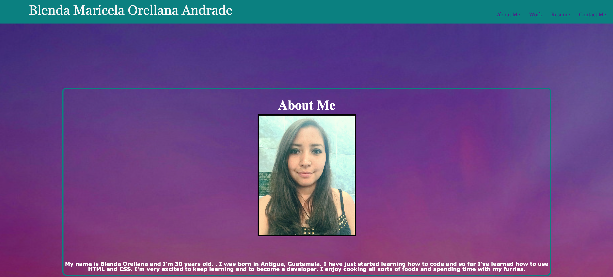

# hw2-portfolio

https://blen90.github.io/hw2-portfolio/

## My task

My task for this homework was to create my personal porftolio from scratch using an HTML file and a CSS stylesheet. 

This porfolio contains the following information:
- My full name Blenda Maricela Orellana Andrade
- Nav bar with links to sections in the page.
- A short paragraph about me and a picture
- My first work application in "work" with a link to view it and a picture and also 3 extra pictures for projects that I will be working on. 
- It contains a direct Googledrive link to my Resume
- Contact information which is not real as I don't feel okay sharing my personal details with links to mailto, linkedin and twitter.
- Footer with information of who created the website which in this case was me. 

# Prerequisites
Before you begin, ensure you have met the following requirements:
* You have installed the latest version of Visual Studio Code. 
* You are using a Windows or Mac OS machine. OS version 10 or above.
* You have installed the lastest Google Chrome browser.

## Screenshot of finished project

